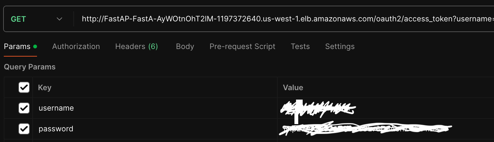
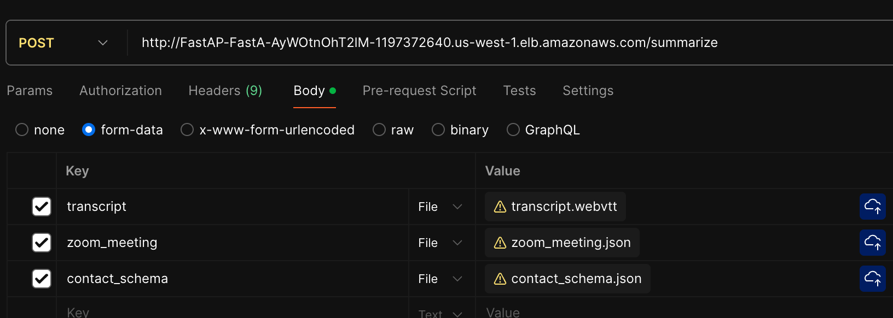

# Meeting contact extraction

## Requirements
- Python >= 3.11
- MODEL_NAME = gpt-4-1106-preview
- OS - MacOS (tested)
## Deployment guide

API was created using FastAPI and deployed on AWS Fargate with a help of  AWS SDK.

1. Make shure that you configured AWS CLI and AWS CDK is bootstrapped.

```
$ aws configure
$ cd cdk
$ cdk bootstrap aws://ACCOUNT-NUMBER/REGION
```
2. Deploy AWS infrastructure stack with cdk comand
```
$ cdk deploy
```

## Usage example

Example of summarization chain results (truncated)
```
[
    {
        "FirstName": "John",
        "LastName": "Doe",
        "Title": "",
        "Department": "Product Team",
        "Email": "john.doe@revenuegrid.com"
    },
    ...
    {
        "FirstName": "Susan",
        "LastName": "Choi",
        "Title": "Sales Manager",
        "Department": "",
        "Email": "susan.choi@techinnovations.com"
    }
]
```
Authorization request

Authorization response (hidden)

```
{
    "message": "Salesforce authenticated successfully!",
    "instance_url": ******,
    "access_token": ******
}
```

Summurization request

Summurization response (truncated)
```
{
    {
        "success": true,
        "created": false,
        "id": "003d2000000IReTAAW",
        "errors": []
    }
    ...
}
```


## Testing

1. Create poetry env and install dependencies 
```
$ poetry env use python{version>=3.11}
$ poetry shell
$ poetry install
```
2. To run tests use the following command:
```
pytest
```

## Cleaning up
To destroy created AWS resources use the following command:
```
$ cdk destroy
```